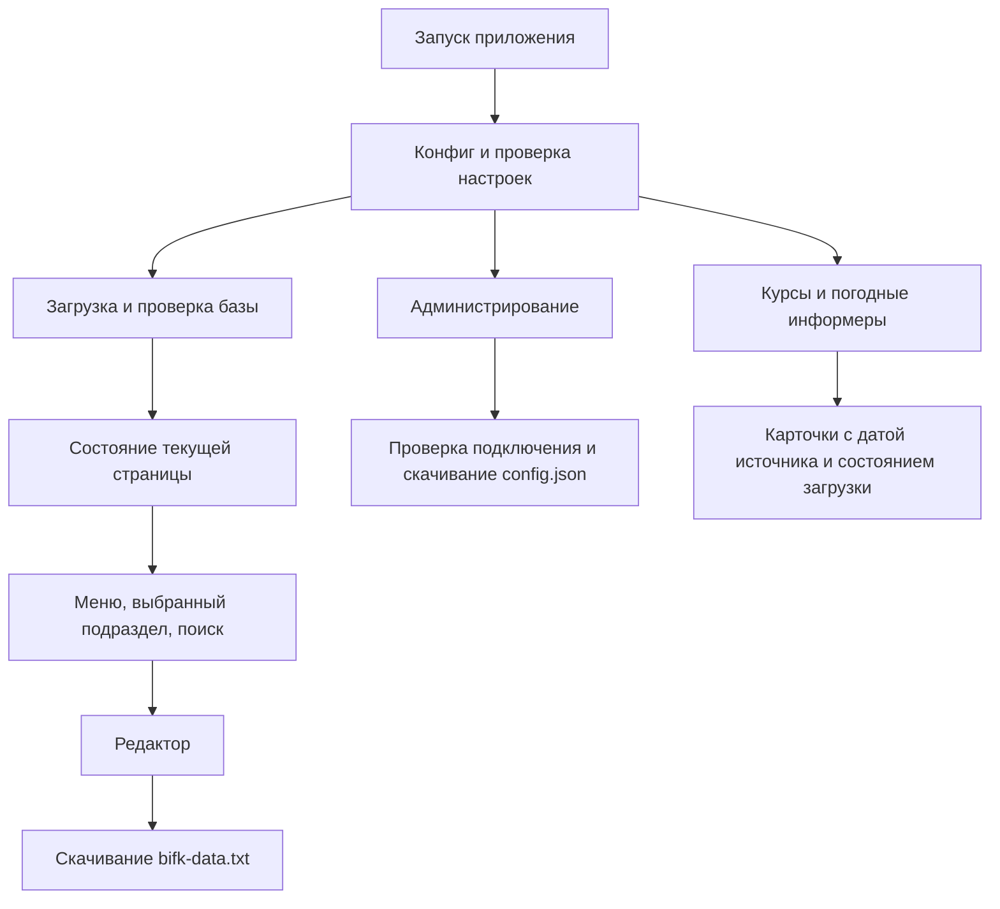

# Справочник БиФК — первая итерация

Старая страница и её данные в корне репозитория сохранены. Точный снимок перед доработкой находится в ветке `backup/2026-10-01`. Новая версия размещена отдельно в `v2/` и использует собственную копию данных.

## Файлы

| Файл | Назначение |
| --- | --- |
| `index.html` | Приложение: вся разметка, CSS, SVG-иконки и JavaScript в одном файле |
| `config.json` | Путь к данным, интервал обновления и настройки блоков показателей |
| `bifk-data.txt` | Реальные разделы, подразделы и записи; формат базы сохранён |

## Структура скриптов

Код внутри единственного HTML разделён комментариями и именованными функциями на проверку конфигурации/данных, загрузку, показатели, представления, редактор и запуск. Таблица создаётся только для выбранного подраздела. Поиск проходит по всей базе.

## Сохранение и SharePoint

«Администрирование» применяет настройки к текущей странице и скачивает `config.json`. Открытие существующего конфига заполняет форму; применение отдельно проверяет подключение. При ошибке настройки и ранее загруженная база сохраняются в текущей странице.

«Скачать bifk-data.txt» и завершение редактирования выгружают базу; отмена возвращает состояние на момент входа в редактор. Запросов записи на SharePoint/GitHub из приложения нет. Не используются localStorage, sessionStorage, IndexedDB, cookies или service worker.

После значка в шапке размещены текстовая надпись «СИБУР» в фирменной цветовой гамме и название подразделения. Название редактируется в общем режиме редактирования и сохраняется в необязательном поле `branding.department` файла `bifk-data.txt`. Старые файлы без этого поля продолжают работать с подписью «БиФК НКНХ». Отмена возвращает исходное название. В редакторе меню плавно расширяется, а кнопки разделов находятся в одной строке с названием; на узком телефоне строка доступна горизонтальной прокруткой. Нажатие вне окна администрирования закрывает его, как кнопка ×.

Для SharePoint разместите HTML (или файл с принятым расширением `.aspx`) и `config.json` рядом. В конфиге задайте относительный путь или HTTPS-ссылку на доступный `bifk-data.txt`. У внешнего домена должно быть разрешено чтение из браузера. Файлы размещает пользователь вручную.

## Показатели

- Курсы USD/EUR/CNY: cbr-xml-daily.ru, JSONP с резервным JSON-запросом, два знака после запятой, дата источника. Интервал 15–1440 минут, по умолчанию 60; скрытая вкладка пропускает обновление.
- Ставка: прямая ссылка на официальную таблицу `https://www.cbr.ru/hd_base/KeyRate/`. Начальное значение 14,00 % проверено по таблице Банка России за 30.09.2026. Это вручную проверенный снимок с явно указанной датой; автоматической загрузки ставки нет. При ручном вводе обязательна дата. Пустое значение оставляет ссылку на ЦБ.
- Погода: два готовых изображения-информера с .ru, светлая палитра rp5 № 21; города и ссылки настраиваются. При ошибке изображения остаётся ссылка на прогноз.
- Иконки встроены в HTML как SVG; внешний CSS/шрифт Font Awesome не подключается.

Ручная ставка не обновляется автоматически. Внутренние ссылки, UNC-пути и файлы требуют корпоративного доступа; файловые пути доступны для копирования.

## Проверка

Проверены синтаксис встроенного JavaScript, исходные данные и конфиг, отклонение неверной структуры записи, недопустимого URL, внешнего домена показателей, некорректной/будущей даты ставки и нулевого интервала. Проверено отсутствие дублированных идентификаторов элементов и внешних CSS/скриптов в разметке.
